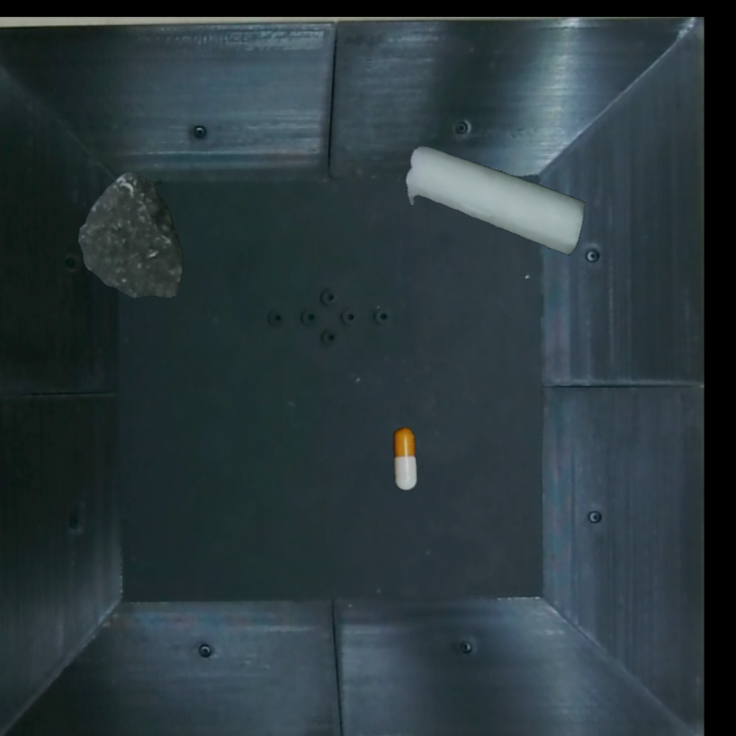

## Overview

This project is a collection of tools for processing datasets used in the YOLO object detection model. It covers functions such as dataset augmentation, format conversion, and division, aiming to help users quickly and effectively prepare high-quality datasets suitable for training the YOLO model.

## Functional Features

1. **Data Augmentation**: Perform diverse data augmentation operations on images and their corresponding annotation files (in XML format), such as rotation, scaling, cropping, adding noise, etc. This expands the scale of the dataset and improves the generalization ability of the model.
2. **Format Conversion**: Achieve the mutual conversion between XML format annotation files and TXT format annotation files required by YOLO, meeting the needs for annotation formats in different scenarios.
3. **Dataset Division**: Automatically divide the original dataset into a training set, a validation set, and a test set according to the proportion specified by the user, ensuring the rational use of the dataset and facilitating the training and evaluation of the model.

## Installation Guide

1. **Environment Requirements**: Python version 3.6 and above.

   ```shell
   pip install YOLODetectionAugment
   ```

## Quick Start

```python
from YOLODetectionAugment.AugmentHelper import process_yolo_dataset
img_path = 'dataset/img' # Your image path
label_path = 'dataset/label' # Your label path
split_list = [0.9, 0.1] # Proportion of the training set and the test set
dics={"battery":0,"bottle":1,"brick":2,"can":3,'carrot':4,'glass':5,'medicine':6,'mooli':7,'package':8,'pebble':9,'potato':10} # Replace these mapping pairs with your own ones

process_yolo_dataset(img_path, label_path, split_list, dics)
```

## Augmentation Effects




