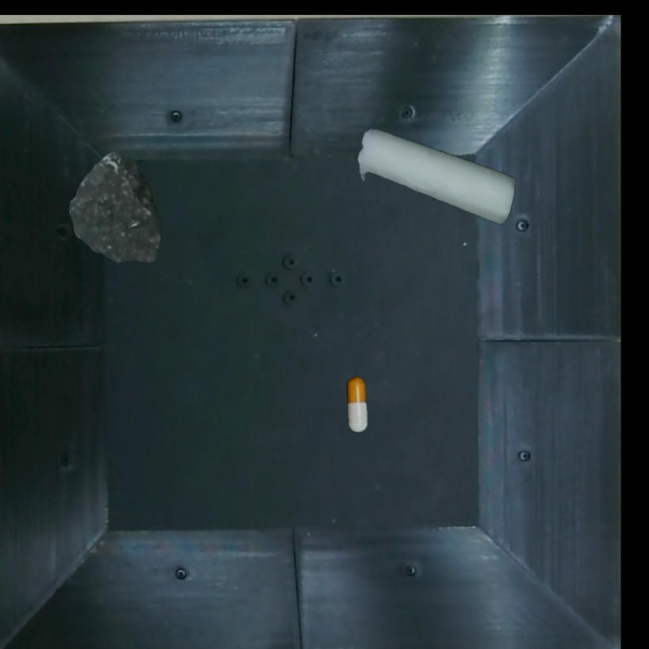
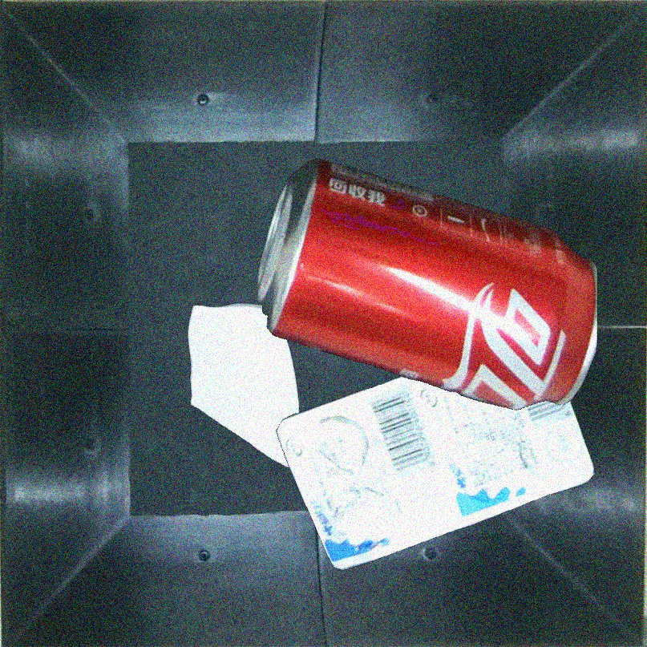
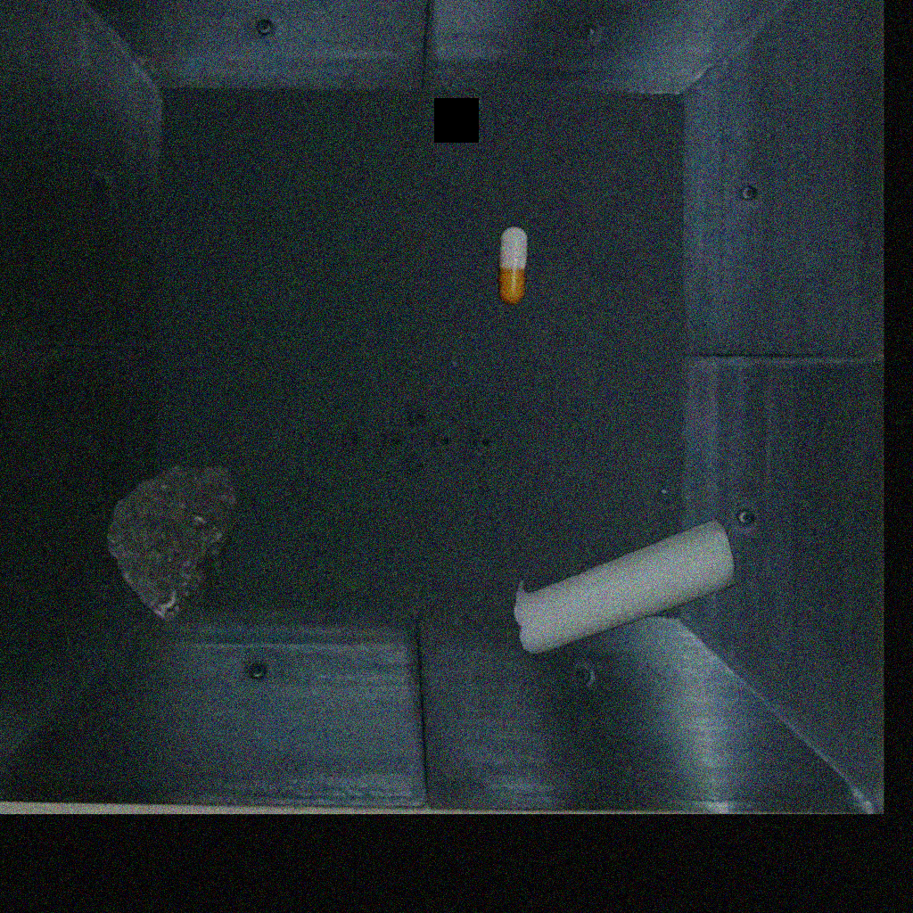

<div align="center">中文 ｜ [English](https://github.com/Huuuuugh/YOLODetectionAugment/blob/main/README_CN.md) 
    <br/>
 [](https://pypi.org/project/YOLODetectionAugment/) [](https://opensource.org/licenses/MIT) 
</div>

## 概述

本项目是一套用于 YOLO 目标检测模型数据集处理的工具集合，涵盖了数据集增强、格式转换、划分等功能，旨在帮助用户快速有效地准备适用于 YOLO 模型训练的高质量数据集。

## 功能特性

1. **数据增强**：对图像及其对应的标注文件（XML 格式）执行多样化的数据增强操作，例如旋转、缩放、裁剪、添加噪声等，以此扩充数据集规模，提升模型的泛化能力。
2. **格式转换**：实现 XML 格式标注文件与 YOLO 所需的 TXT 格式标注文件之间的相互转换，满足不同场景下对标注格式的需求。
3. **数据集划分**：依据用户指定的比例，将原始数据集自动划分为训练集、验证集和测试集，确保数据集的合理使用，便于模型的训练与评估。

## 安装指南

1. **环境要求**：Python 3.6 及以上版本。

   ```shell
   pip install YOLODetectionAugment
   ```

## 快速开始

```python
from YOLODetectionAugment.AugmentHelper import process_yolo_dataset
img_path = 'dataset/img' #你的图像路径
label_path = 'dataset/label' #你的标签路径
split_list = [0.9, 0.1] # 训练集和测试集的比例
dics={"battery":0,"bottle":1,"brick":2,"can":3,'carrot':4,'glass':5,'medicine':6,'mooli':7,'package':8,'pebble':9,'potato':10} #将这里的映射对替换成你自己的

process_yolo_dataset(img_path, label_path, split_list, dics)
```

## 增强效果




